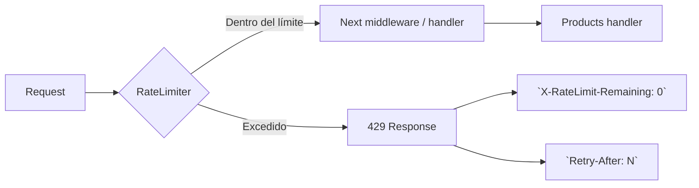

## Context

Los endpoints de `/api/products` actualmente no tienen ninguna protección contra solicitudes excesivas. Los endpoints públicos (`GET /` y `GET /:id`) son particularmente vulnerables a scraping y denegación de servicio, agravado por el bug N+1 existente en el listado. Los endpoints de escritura (`POST`, `PUT`, `DELETE`) están protegidos por JWT pero carecen de límites por si un token se ve comprometido.

El proyecto actualmente no usa ninguna solución de rate limiting. `express-rate-limit` es el middleware estándar para Express, funciona en memoria y no requiere infraestructura externa.

## Goals / Non-Goals

**Goals:**
- Proteger los 5 endpoints de products contra abuso con límites diferenciados
- Respuesta consistente `429 Too Many Requests` con body JSON y headers estándar
- Middleware reutilizable para futuros endpoints

**Non-Goals:**
- Rate limiting global para toda la aplicación (solo products)
- Rate limiting para otros módulos (auth, cart, orders, admin)
- Store persistente (Redis, DB) — se usa store en memoria
- Rate limiting por usuario autenticado (solo por IP)

## Decisions

| Decisión | Alternativas | Por qué |
|----------|-------------|---------|
| `express-rate-limit` versión 7 | `rate-limiter-flexible`, `express-brute` | Es el middleware más usado en Express, tiene soporte TypeScript nativo, headers estándar y API simple. `rate-limiter-flexible` ofrece más features pero agrega complejidad innecesaria para este alcance |
| Store en memoria | Redis, PostgreSQL | El proyecto es monólito SQLite sin打算 de escalar horizontalmente. Store en memoria es suficiente para el alcance del workshop. Migrar a `rate-limit-redis` sería trivial si se necesita después |
| Límites por IP | Por userId | Los endpoints públicos no tienen autenticación, no hay userId disponible. En los endpoints protegidos también usamos IP por consistencia y simplicidad. Mejora futura: key por userId en endpoints autenticados |
| Middleware por ruta (no global) | Middleware global | Diferentes endpoints necesitan límites distintos (lectura pública 30/min, escritura protegida 15/min). Aplicar por ruta da control granular. Si se necesita un límite global, se puede agregar después como capa adicional |

## Flujo

## Archivos

**Nuevos:**
- `backend/src/middleware/rateLimiter.ts`

**Modificados:**
- `backend/src/routes/products.ts` — agregar middleware rate limiter a cada ruta
- `backend/package.json` — agregar dependencia `express-rate-limit`
- `backend/package-lock.json` — actualizado por npm install

**Tests:**
- `backend/src/__tests__/products.test.ts` — mock de rate limiter en tests existentes + nuevos tests de 429

## Consideraciones de seguridad y rendimiento

- Headers `X-RateLimit-Limit` y `X-RateLimit-Remaining` incluidos para transparencia
- `Retry-After` en segundos para que el cliente sepa cuándo reintentar
- Store en memoria usa un `Map` interno con cleanup periódico (no hay fuga de memoria)
- Los límites elegidos (30 GET/min, 15 write/min) son conservadores para evitar falsos positivos
- El orden de middleware importa: `authenticate` antes que `writeLimiter` — así el rate limit actúa sobre requests ya identificadas

## Risks / Trade-offs

| Riesgo | Mitigación |
|--------|------------|
| Store en memoria se pierde al reiniciar el servidor | Aceptable — los contadores empiezan de cero. No hay datos persistentes en riesgo |
| Si el server recibe muchas IPs distintas, el Map crece | `express-rate-limit` hace cleanup periódico automático de entradas expiradas |
| Tests pueden fallar por interacción entre tests (contador compartido) | Usar `vi.mock` para que el limiter sea no-op en tests existentes; crear app limpia por test para tests de rate limiting |
