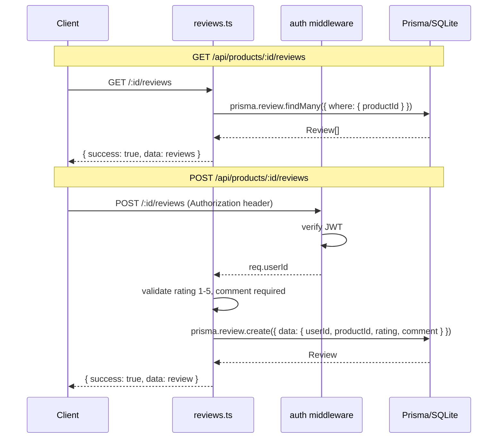

## Context

Actualmente el modelo `Product` no tiene relación con reviews. Los usuarios no pueden valorar productos. Se necesita añadir una tabla `Review` y dos endpoints REST dentro del resource de productos.

## Goals / Non-Goals

**Goals:**
- Añadir modelo `Review` en Prisma con `userId`, `productId`, `rating` (1-5), `comment`, `createdAt`
- Endpoint `GET /api/products/:id/reviews` público que devuelve todas las reviews de un producto
- Endpoint `POST /api/products/:id/reviews` autenticado que crea una review
- Unique constraint `(userId, productId)` para evitar reviews duplicadas

**Non-Goals:**
- Editar o eliminar reviews (fuera de scope)
- Frontend de reviews
- Rating promedio en el producto (futura mejora)

## Decisions

| Decisión | Alternativas | Por qué |
|---|---|---|
| Reviews anidadas bajo `/api/products/:id/reviews` | Endpoint separado `/api/reviews` | Sigue el patrón REST de recursos anidados; la review pertenece a un producto |
| Ruta en `reviews.ts` separado | Añadir a `products.ts` | Separación de concerns; el archivo de productos ya es extenso |
| Unique constraint `(userId, productId)` a nivel BD | Validación en aplicación | Garantiza integridad aunque haya race conditions |
| Rating como `Int` con validación 1-5 | `Float` o `String` | Coincide con el dominio (estrellas enteras); Prisma valida tipo |

## Flujo

No requiere más de 3 pasos — el diagrama cubre ambos flujos.

## Archivos nuevos y modificados

**Nuevos:**
- `backend/prisma/migrations/XXXXX_add_review/` — migración
- `backend/src/routes/reviews.ts` — router con los endpoints

**Modificados:**
- `backend/prisma/schema.prisma` — añadir modelo `Review`
- `backend/src/index.ts` — registrar `app.use('/api/products', reviewRoutes)`

## Consideraciones de seguridad

- `POST` protegido con middleware `authenticate`
- El `userId` se toma del token JWT (`req.userId`), no del body
- Validación de rating (1-5) y comment (no vacío) antes de escribir

## Consideraciones de rendimiento

- La tabla Review tendrá un índice compuesto `(productId, userId)` vía unique constraint
- `GET` no requiere autenticación; respuesta ligera (solo texto + entero)
- Sin N+1 porque se consulta directo por `productId`

## Risks / Trade-offs

- **Risk**: Usuario puede crear muchas reviews seguidas. → Mitigación: unique constraint evita duplicados; rate limiting se abordará en futura issue.
- **Risk**: No hay sanitización de `comment` (XSS). → Mitigación: el frontend escapará HTML al renderizar; considerar sanitize en futura iteración.
