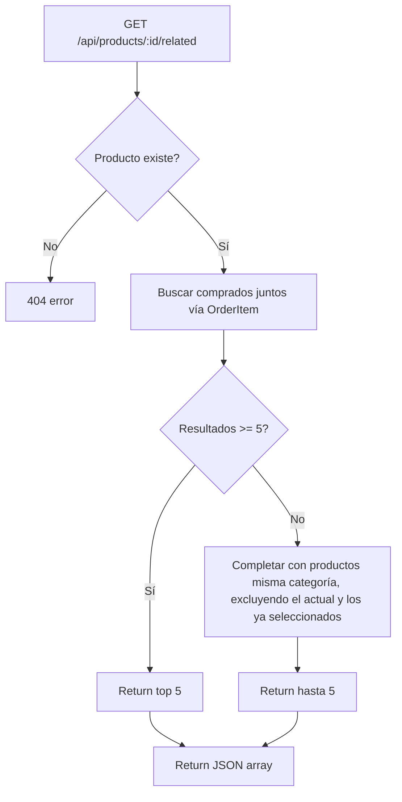

## Context

GameStore actualmente expone `GET /api/products/:id` para detalle de producto pero no muestra productos relacionados. El modelo `OrderItem` ya almacena qué productos se compran juntos en cada orden, lo que permite consultas analíticas sin cambios de schema.

## Goals / Non-Goals

**Goals:**
- Endpoint `GET /api/products/:id/related` que devuelva máximo 5 productos relacionados
- Estrategia de dos niveles: (1) analytics de órdenes, (2) fallback por categoría
- Componente frontend `RelatedProducts` en la página de detalle de producto
- Pruebas backend para el nuevo endpoint

**Non-Goals:**
- Recomendaciones personalizadas por usuario (basadas en historial individual)
- Sistema de caché distribuida (Redis, etc.)
- Paginación de recomendaciones

## Decisions

| Decisión | Alternativas | Por qué |
|---|---|---|
| Estrategia de dos niveles: analytics → categoría | Solo categoría, solo analytics, ML-based | Analytics da mejores resultados cuando hay datos; categoría es fallback robusto para productos sin histórico de órdenes |
| Prisma `$queryRaw` para analytics | Prisma ORM puro (múltiples queries) | `$queryRaw` permite una sola consulta SQL eficiente con GROUP BY + COUNT + ORDER BY + LIMIT |
| Respuesta como array de productos | Objeto anidado con metadatos | Consistente con otros endpoints (`GET /api/products/` responde con array) |
| Límite fijo de 5 | Configurable por query param | Evita abusos; 5 es suficiente para UX de "productos relacionados" |
| Componente React independiente | Lógica inline en ProductDetail | Separación de concerns; reutilizable si se muestra en otras vistas (carrito, checkout) |

## Flujo del endpoint



## Archivos

### Nuevos
- `frontend/src/components/RelatedProducts.tsx` — Componente React para mostrar productos relacionados

### Modificados
- `backend/src/routes/products.ts` — Nuevo handler para `GET /:id/related`
- `frontend/src/services/api.ts` — Nuevo método `getRelated(id: number)`
- `frontend/src/pages/ProductDetail.tsx` — Integrar componente `RelatedProducts` (o crear si no existe)
- `backend/src/__tests__/products.test.ts` — Tests para el nuevo endpoint
- `openspec/specs/catalog/spec.md` — Nueva sección "Product Recommendations"

## API Contract

```
GET /api/products/:id/related
```

**Response 200:**
```json
[
  {
    "id": 2,
    "name": "Zelda: Tears of the Kingdom",
    "price": 69.99,
    "category": "Adventure",
    "image": "/img/zelda-totk.jpg",
    "stock": 15,
    "description": "The sequel to Breath of the Wild"
  }
]
```

**Response 404:**
```json
{ "error": "Product not found" }
```

**Response 200 (empty):**
```json
[]
```

## Prisma Queries

### Analytics — comprados juntos
```sql
SELECT productId, COUNT(*) as frequency
FROM OrderItem
WHERE orderId IN (
  SELECT orderId FROM OrderItem WHERE productId = :targetId
)
AND productId != :targetId
GROUP BY productId
ORDER BY frequency DESC
LIMIT 5
```

### Fallback — misma categoría
```typescript
prisma.product.findMany({
  where: { category: targetProduct.category, id: { not: targetId } },
  take: 5
})
```

## Seguridad

- Endpoint público (no requiere auth) — igual que `GET /api/products/:id`
- Validar que `:id` sea un número entero positivo
- Limitar resultados a 5 para evitar abuso

## Rendimiento

- Analytics query usa índice en `OrderItem.productId` y `OrderItem.orderId`
- SQLite con dataset pequeño (~50 productos, pocas órdenes) — sin preocupaciones inmediatas
- Si el volumen crece, considerar caché en memoria con TTL de 5 minutos

## Open Questions

- ¿Existe ya una página de detalle de producto (`ProductDetail.tsx`)? Si no, crearla.
- ¿El frontend debe mostrar los related products como tarjetas pequeñas o igual que los productos normales?
